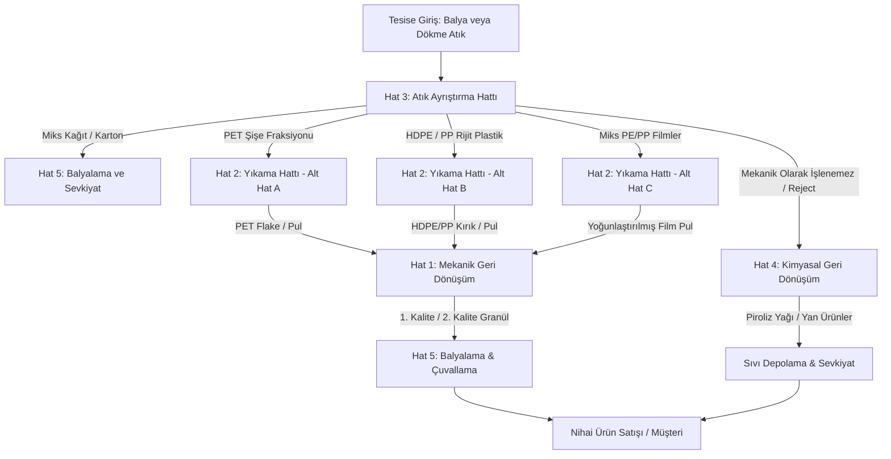

# Geri Dönüşüm Sektör Rehberi (Domain Hub)

> **Tip:** Wiki Sayfası / Sektörel Hub
> **Oluşturma:** 2026-05-28
> **Durum:** Aktif / Referans Dokümanı

Geri dönüşüm tesislerinde verimli planlama ve doğru maliyet analizi yapabilmek için tesis içi malzeme akışlarının ve hatlar arası ilişkilerin iyi anlaşılması gerekir. Enba Similasyon, bu ilişkileri modelleyerek simüle etmek üzere tasarlanmıştır.

Bu sayfa, geri dönüşüm tesislerinde kurulu olan 5 temel üretim ve lojistik hattının ilişkilerini ve entegre malzeme döngüsünü özetler.

---

## 🔄 Entegre Malzeme ve Proses Akışı

Bir geri dönüşüm tesisine giren karışık plastik veya kağıt atık, nihai sevkiyata kadar aşağıdaki hatlar arasında dolaşır:

---

## 🏢 Geri Dönüşüm Hatları Detaylı Rehberi

Her hattın kendine özgü proses adımları, makine parkurları, fire oranları ve kalite kriterleri vardır. Detaylı sektörel bilgilere aşağıdaki sayfalardan ulaşabilirsiniz:

### [1. Hat 1 · Mekanik Geri Dönüşüm Hattı](file:///c:/Users/Fujitsu/OneDrive/Desktop/Enba%20Similasyon/Enba_Obsidian_Vault/Wiki/Hatlar/Hat1-Mekanik-Geri-Donusum.md)
*   **Özet:** Temizlenmiş plastik pulların (flake) kırma, kurutma ve ekstrüzyon-granülasyon adımlarından geçirilerek pelet (granül) haline getirildiği hattır. Sektörün en yaygın ve temel hat tipidir.
*   **Kritik Konu:** Nem kontrolü ve eriyik filtre basıncı.

### [2. Hat 2 · Yıkama Hattı](file:///c:/Users/Fujitsu/OneDrive/Desktop/Enba%20Similasyon/Enba_Obsidian_Vault/Wiki/Hatlar/Hat2-Yikama-Hatti.md)
*   **Özet:** Balyalanmış veya karışık gelen atıkların kırılarak ıslak yıkama, sıcak kaustik banyosu ve kurutma işlemlerinden geçirilip temiz pullar (flake) ürettiği hattır. Özellikle PET şişe geri dönüşümünde en kritik aşamadır.
*   **Kritik Konu:** Kaustik sıcaklığı (80-90°C), durulama pH derecesi ve PVC kontaminasyonu.

### [3. Hat 3 · Atık Ayrıştırma Hattı](file:///c:/Users/Fujitsu/OneDrive/Desktop/Enba%20Similasyon/Enba_Obsidian_Vault/Wiki/Hatlar/Hat3-Atik-Ayristirma-Hatti.md)
*   **Özet:** Karışık gelen atıkların boyut eleme, balistik ayırma, manyetik ayrıştırma ve NIR (Yakın Kızılötesi) sensörlü optik ayırıcılar yardımıyla reçine ve renk tiplerine göre fraksiyonlara bölündüğü hattır.
*   **Kritik Konu:** NIR siyah plastik algılama sorunu, yanlış ejeksiyon oranları ve PVC ayrımı.

### [4. Hat 4 · Kimyasal Geri Dönüşüm Hattı](file:///c:/Users/Fujitsu/OneDrive/Desktop/Enba%20Similasyon/Enba_Obsidian_Vault/Wiki/Hatlar/Hat4-Kimyasal-Geri-Donusum.md)
*   **Özet:** Mekanik geri dönüşümle işlenemeyen çok kirli, çok katmanlı, gıda temaslı veya reject plastiklerin termal piroliz, glikoliz/depolimerizasyon ve solvent bazlı çözme yöntemleriyle kimyasal hammaddelere (pyoil, monomer) dönüştürüldüğü ileri teknoloji hattıdır.
*   **Kritik Konu:** PVC (klorür) ve nem toleransları, solvent geri kazanım verimliliği.

### [5. Hat 5 · Balyalama · Çuvallama · Sevkiyat Hattı](file:///c:/Users/Fujitsu/OneDrive/Desktop/Enba%20Similasyon/Enba_Obsidian_Vault/Wiki/Hatlar/Hat5-Balyalama-Sevkiyat.md)
*   **Özet:** Hat çıktılarının satışa hazır ambalajlara (balya, big bag çuval, oktabin kutu) doldurulduğu, tartıldığı, lot numaralarıyla etiketlendiği ve Incoterms kurallarına göre sevk edildiği lojistik çıkış kapısıdır.
*   **Kritik Konu:** Lot izlenebilirliği, tartım kalibrasyonları, balya yoğunluğu ve FIFO depo yönetimi.

---

## 📊 Yazılıma Entegrasyon ve Simülasyon Esasları

Enba Similasyon içerisinde bu dikey bilgiler aşağıdaki hesaplama ve planlama motorlarının temelini oluşturur:

1.  **DetailedPlan Sihirbazı:** `ProductionModel` kuralları, her makinenin kW gücü, çalışma saati ve talep faktörünü (DF) kullanarak enerji maliyetini dinamik hesaplar (Bkz: [[Kararlar/2026-05-GranulUretimi-Parametre|Granül Üretimi Parametreleri]]).
2.  **Fire ve Verim Motoru:** Giren malzemenin nem, çöp ve alt kalite fraksiyon modları (A ve B modları) simüle edilerek nakit akışına ve P&L tablosuna yansıtılır (Bkz: [[Wiki/Geri-Donusum-Proses-Bilgisi|Geri Dönüşüm Proses Bilgisi]]).
3.  **İzlenebilirlik (Lot Yönetimi):** GRS ve ISO standartlarına uyum sağlamak üzere üretilen her lotun hammadde girdisine kadar takip edilebildiği veri yapıları tasarlanmıştır.

---

## İlgili Sayfalar
*   [[Wiki/Geri-Donusum-Proses-Bilgisi|Geri Dönüşüm Proses Bilgisi]]
*   [[Wiki/Piyasaya-Cikis-Stratejisi|Piyasaya Çıkış Stratejisi]]
*   [[Kararlar/2026-05-GranulUretimi-Parametre|Granül Üretimi Parametreleri]]
