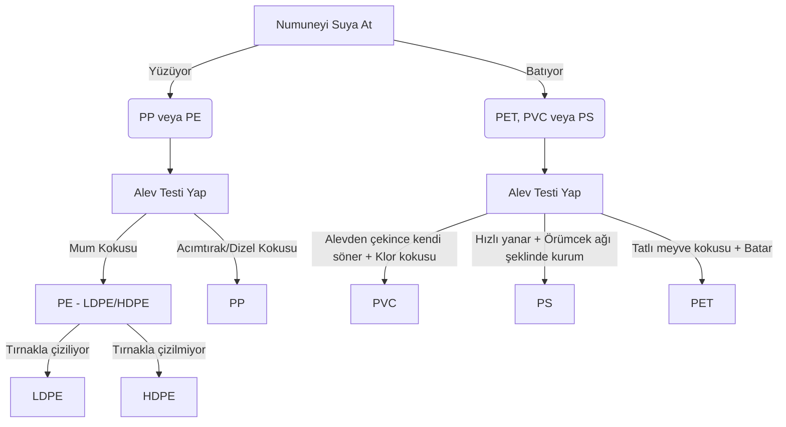

# Basit Tekniklerle Plastik Tanımlama Rehberi

Geri dönüşüm tesislerinde, pahalı optik (NIR/XRF) spektroskopi cihazları bulunmadığında veya hızlı saha doğrulaması gerektiğinde, operatörler basit fiziksel ve kimyasal testler kullanarak polimer türlerini teşhis edebilirler. Bu rehber; Yüzdürme (Yoğunluk), Yakma, Koklama ve Çizme testlerini özetler.

---

## 1. Test Yöntemleri ve Uygulama Adımları

### A. Yüzdürme (Yoğunluk) Testi
Plastiğin su ($1.0 \text{ g/cm}^3$) veya alkol-su karışımı içerisindeki yüzme/batma davranışına bakılır.
*   **Yoğunluk < 1.0 (Yüzenler):** PE (LDPE/HDPE) ve PP.
*   **Yoğunluk > 1.0 (Batanlar):** PET, PVC, PS.

### B. Yakma ve Alev İzleme Testi
Temiz bir plastik numunesi kerpeten yardımıyla tutularak alev kaynağına (çakmak/bek alevi) yaklaştırılır. Alev rengi, erime davranışı ve kendi kendine sönme özelliği gözlemlenir.

### C. Koklama Testi
Alev söndürüldükten hemen sonra yükselen dumanın kokusuna bakılır. *Güvenlik uyarısı: Duman doğrudan ciğerlere çekilmemeli, el yardımıyla buruna doğru yönlendirilmelidir.*

### D. Fiziksel ve Çizme (Sertlik) Testi
Malzemenin tırnakla çizilebilirliği veya büküldüğünde beyazlama yapıp yapmadığı kontrol edilir.

---

## 2. Polimer Bazlı Teşhis Matrisi

Aşağıdaki tablo, 6 temel plastik türünün basit testlerdeki karakteristik tepkilerini göstermektedir:

| Polimer | Suda Yüzer mi? | Alev Davranışı ve Rengi | Duman / Kurum | Söndükten Sonraki Koku | Fiziksel Özellik |
| :--- | :--- | :--- | :--- | :--- | :--- |
| **PET** (1) | ❌ Batar | Yavaş yanar, mavi alev tabanı ve sarı uç | Siyah kurum bırakır | Tatlı, meyvemsi koku | Sert, büküldüğünde beyazlamaz |
| **HDPE** (2) | ✅ Yüzer | Melterek damlar, mavi alev ve sarı uç | Duman yok veya az | Mum (parafin) kokusu | Sert, tırnakla çizilmez |
| **PVC** (3) | ❌ Batar | Zor yanar, alevden çekilince söner, sarı/yeşil alev | Yoğun siyah duman | Keskin, asidik, klor/tuz ruhu kokusu | Büküldüğünde beyaz iz bırakır |
| **LDPE** (4) | ✅ Yüzer | Melterek damlar, HDPE ile aynı | Duman yok | Mum (parafin) kokusu | Yumuşak, esnek, tırnakla çizilir |
| **PP** (5) | ✅ Yüzer | Melterek damlar, parlak alev | Duman yok | Acımtırak, dizel/asfalt kokusu | Esnektir, kırılması zordur |
| **PS** (6) | ❌ Batar | Hızla yanar, damlamaz | Havada uçuşan örümcek ağı gibi kurum | Tatlı, kömür gazı veya çiçek (kadife çiçeği) kokusu | Gevrek, kırılınca çıt sesi çıkarır |

---

## 3. Sahada Pratik Akış Diyagramı (Teşhis Algoritması)

Operatörün sahada izleyeceği karar adımları:

---

## 4. Güvenlik ve Sınırlamalar

> [!CAUTION]
> *   **Zehirli Gaz Riski:** PVC yandığında son derece zehirli olan Klor gazı ve Dioksin bileşikleri açığa çıkarır. Yakma testleri açık havada veya çeker ocak (laboratuvar davlumbazı) altında yapılmalıdır.
> *   **Kompozit Malzemeler:** Çok katmanlı (multi-layer) veya katkılı plastikler (örn: kalsit dolgulu PP) su testinde batabilir veya yakma testinde karışık kokular verebilir. Kesin sonuç için FTIR spektroskopisi esastır.
